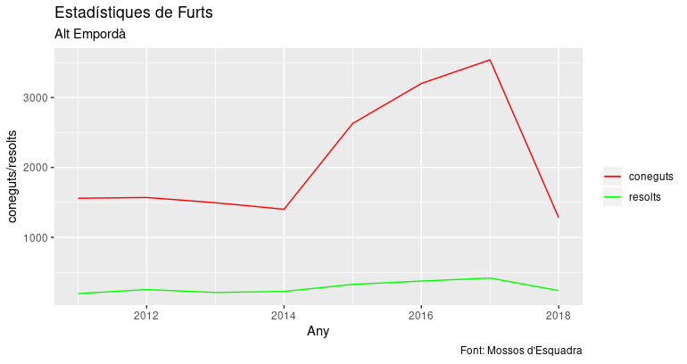
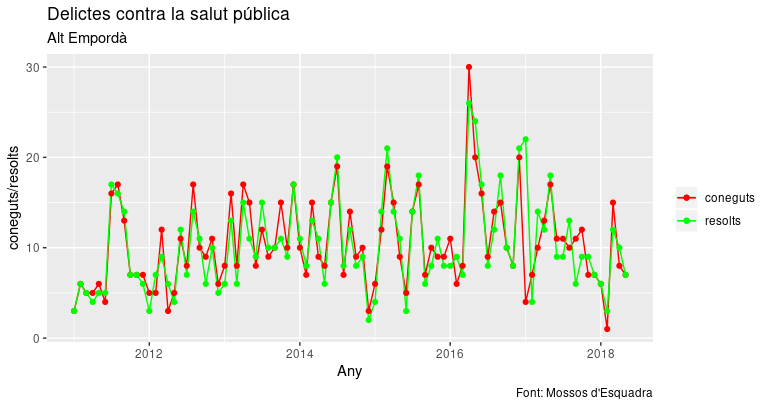

# Denuncies presentades als Mossos d'esquadra

Des de fa temps tothom em parla meravelles del llenguatge R. Per això m'he decidit a fer unes proves senzilles per comprovar-ne el potencial.

El que hi ha aquí són simplement proves que he fet per veure com funciona R.

Les dades estan extretes de les dades obertes dels Mossos d'Esquadra. La llicència indica que he de dir (citació de la font, no alteració ni desnaturalització de la informació i especificació de la data d'última actualització)

- Dades obtingudes de la pàgina de [dades obertes dels Mossos d'Esquadra](https://mossos.gencat.cat/ca/els_mossos_desquadra/indicadors_i_qualitat/dades_obertes/)
- Descarregat el 25 d'agost de 2018
- Data de darrera actualització: 43270

## Requeriments

Cal tenir R, i les llibreries instal·lades perquè dóni algun resultat.

Amb RStudio es poden fer gràfics a partir de totes les dades, però al fer l'script he optat per només mostrar les dades resumides per pantalla.

    ggplot(dades_ae, aes(x=Any)) +
       geom_line(aes(y=coneguts, color="coneguts")) +
       geom_line(aes(y=resolts, color="resolts")) +
       labs(title="Estadístiques de Furts", subtitle="Alt Empordà", y="coneguts/resolts", x="Any", caption="Font: Mossos d'Esquadra") +
        scale_colour_manual("", breaks = c("coneguts", "resolts"), values = c("red", "green"))

    dades_ae <- denuncies_ae %>% filter(grepl("salut", Delicte)) %>% group_by(AnyMes) %>% summarise(coneguts=sum(Coneguts), resolts=sum(Resolts) )

    ggplot(dades_ae, aes(x=Any)) +
       geom_line(aes(y=coneguts, color="coneguts")) +
       geom_line(aes(y=resolts, color="resolts")) +
       labs(title="Delictes contra la salut pública", subtitle="Alt Empordà", y="coneguts/resolts", x="Any", caption="Font: Mossos d'Esquadra") +
       scale_colour_manual("", breaks = c("coneguts", "resolts"), values = c("red", "green")) +
        geom_point(aes(y=coneguts, color="coneguts"))  +
        geom_point(aes(y=resolts, color="resolts"))

## Funcionament

El primer és donar-li permisos d'execució

    $ chmod +x delictes.R
    $ ./delictes.R
    Error: Almenys has d'especificar 'helpABP', per veure els ABP, 'helpDelictes', per veure els delictes, el delicte a mostrar (delicte) o (el delicte i l'ABP)
    Execution halted

Per veure les àrees bàsiques policials (ABP) disponibles:

    $ ./delictes helpAPB
    There were 26 warnings (use warnings() to see them)
                                    ABP
    1                      Arenys de Mar
    2                           Badalona
    3                         Cerdanyola
    4                         Granollers
    5                             Mataró
    ...

O els tipus de delictes

    $ ./delictes helpDelictes
    There were 26 warnings (use warnings() to see them)
                          Delicte
    1                     De la usurpació de l'estat civil
    2                     Falsedats documentals
    3                     Lesions
    4                     Tracte degradant / vexatori
    5                     Apropiació indeguda
    6                     Danys
    7                     Estafes
    8                     Furt
    9                     Receptació i altres conductes afins
    ...

Per veure l'estadística d'un determinat delicte només cal espificar-lo (les dades de 2018 no són completes)

    $ ./delicte.R Furt
    There were 26 warnings (use warnings() to see them)
    year.AnyMes.   coneguts resolts
    1         2011    64493    8160
    2         2012    67835    8448
    3         2013    65491    8993
    4         2014    63094    8347
    5         2015   132422   18199
    6         2016   198904   30423
    7         2017   210443   31114
    8         2018    89420   14001

També es pot especificar text comú en diferents delictes per veure'n l'estadística acumulada. Per exemple "Homicidi" surt tres vegades:

    $ ./delictes.R helpDelictes | grep Homicidi
    26                               Homicidi per imprudència
    27                               Homicidi temptativa
    54                               Homicidi consumat

O sigui que:

    ./delictes.R "Homicidi consumat"
    year.AnyMes.   coneguts resolts
    1         2011       69      72
    2         2012       67      68
    3         2013       34      39
    4         2014       50      43
    5         2015       32      33
    6         2016       48      54
    7         2017       36      37
    8         2018       15      17

I l'estadística dels tres delictes:

    ./delictes.R Homicidi
    year.AnyMes.   coneguts resolts
    1         2011      292     278
    2         2012      332     305
    3         2013      217     210
    4         2014      239     220
    5         2015      209     202
    6         2016      256     246
    7         2017      255     252
    8         2018      102     102

Es poden obtenir les dades d'una ABP de la mateixa forma:

    $ ./delictes.R Amenaces "Alt Empordà"
    Any    coneguts resolts
    1 2011      145     147
    2 2012      128     125
    3 2013      120     115
    4 2014      171     161
    5 2015      242     220
    6 2016      334     301
    7 2017      315     286
    8 2018      139     128

Simplement especificant una part de l'ABP:

    $ ./delictes.R Amenaces Figueres
    Any    coneguts resolts
    1 2011       92      93
    2 2012       84      83
    3 2013       70      66
    4 2014      116     107
    5 2015      164     146
    6 2016      247     226
    7 2017      230     208
    8 2018       90      87

Si volem les estadístiques de tot l'Empordà (Alt i Baix) només cal trobar una paraula comuna ... Empordà? ;-)

    $ ./delictes.R helpABP | grep Empordà
    21            Alt Empordà - Figueres
    22               Alt Empordà - Roses
    23          Baix Empordà - La Bisbal
    24         Baix Empordà - Sant Feliu

No hi ha cap denuncia de 'tortures':

    ./delictes.R Tortures Empordà
    [1] Any      coneguts resolts
    <0 rows> (or 0-length row.names)

Però hi ha 'segrests':

    ./delictes.R "Segrest" Empordà
    There were 26 warnings (use warnings() to see them)
    Any    coneguts resolts
    1 2011        1       1
    2 2012        2       1
    3 2013        1       1
    4 2014        1       1
    5 2017        1       1
